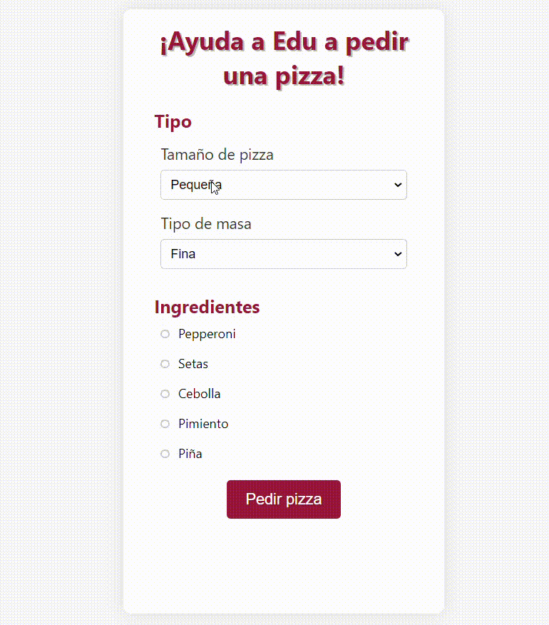

## Challenge: Pizza form

En este challenge tenéis que hacer un formulario similar al del ejemplo utilizando JS, CSS y HTML.
Requisitos:

- Diseño accesible: checkboxes que permitan hacer check clickando el nombre.
- HTML semántico, usando clases en lugar de ID y siendo estas descriptivas.
- CSS adecuado, agradable para el usuario, respetando el espaciado.
- Debe tener un favicon y título.
- Javascript:
  - En caso de no añadir ingredientes, se debe avisar al usuario de que es un campo obligatorio.
  - Una vez se añade la pizza, el botón debe cambiar a uno que permita añadir una pizza nueva y además se debe dar feedback al usuario indicando que la pizza fue creada correctamente.
  - Uso de querySelector.
  - Uso de camelCase para el naming, descriptivo, en inglés y sin abreviaturas.

